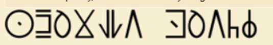

Puzzle 10 uses the following image: 

After some research it turned out this image uses the "Wakanda Alphabet".
Because we found this we could find the relating letters:
https://stock.adobe.com/nl/images/wakanda-alphabet-designed-on-white-background-vector-illustration/504818885

After translating it, it gives the following result: "fluent dutch", if you make this "vloeiend" it is correct.