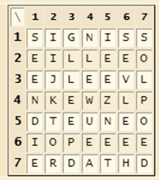

Puzzle 20 uses the following image:

We got the following hints in part 2: 
- spiral (gathered from "S", P", "I", "R", "A", "L" from puzzle 11, 12, 16, 17, 18 and 19)
- "from the water to the air" from puzzle 15

Using this information we eventually found the solution.
When you follow the letters/grid from the image in a spiral, counterclockwise, you get a sentence.
"de oplossing is een dier dat heel veel lijkt op een zeeleeuw". 
Since we were using words as tips instead of hints we thought that they
meant the word "zeeleeuw", and not the animal. Low and behold, the first guess, zeemeeuw, was correct.