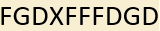

Puzzle 30 provided us with the following string:



The hints we got during part 3 where:
- Painvin, from puzzle 24
- A, D, F, G, X from puzzles 22, 23, 25, 28 and 29
- Key = CDEFGHIJKLMNOPQRSTUVWXYZA, from puzzle 27

When you Google Painvin you find that Georges Painvin is best known for creating the ADFGX/ADFGVX cipher.
How the ADFGX cipher works is that a 5x5 matrix is used as key (see the matrix below).


```
  | A D F G X
--+------------
A | C D E F G 
D | H I J K L 
F | M N O P Q 
G | R S T U V
X | W X Y Z A
```

When we try to decode the string in the image (FGDXFFFDGD) with the given key we get PLONS.