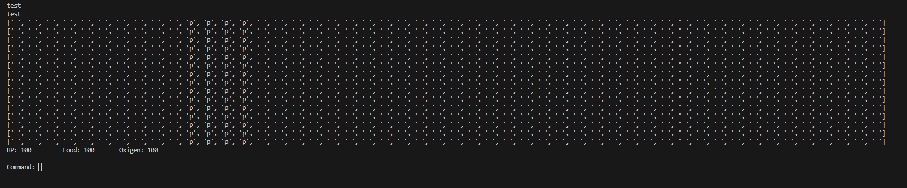
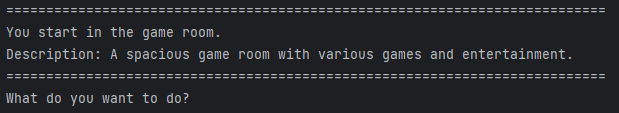

## Class based rewrite of Challenge Week 1 in my spare time

In some of my spare time a friend (from Technical Computer Science) and 
I challenged each other to quickly come up with a game concept while still following the guidelines of challenge 1.
As we are both pretty experienced with writing software (we did projects with each-other before) we did add some rules of our own.

**The additional rules:**

```
- AI is not allowed unless you use it for JSON.
- It can't have errors.
- You can't copy any existing work (Websites like stackoverflow are allowed)
- You can use libraries as long as it's build into Python.
```

**The normal rules:**
```
Minimal requirements:
- 10 locations
- 10 items
- 5 puzzles
- All python techniques of week 1-3
- No errors
- No copies of work from fellow students or adventures found on the internet
- Theme must be SPACE TRAVEL

Nice to have:
- Images (look at the turtle library in python)
- Sounds (depends on your operating system)
- Understand commands like GO WEST, OPEN THE DOOR, PICK UP LASER …..
```

Obviously, for a challenge for a small evening we didn't do 10 locations, 10 items or 5 puzzles. This much wouldn't be reasonable in a few hours.

**After the challenge:**<br> 
This resulted into a fun challenge from around 2 hours after which we stopped (we both didn't finish). 
Why we thought it was fun is because even though we had a lot of rules we both came up with a whole other concept.
He went for a 'Super Mario Bros. (1985)' styled game but then based completely on ASCII. 
I went with the game concept we used during the challenge week, so I could look how much time I would need to write a game
with the same core concepts (so ignoring stuff like a story). So a 'Space Quest I' like command system but without any real visuals.

Some of the screenshots we shared early in the evening were:

His Super Mario Bros like game:


My game, a Space Quest like game:


You can find my code on GitHub: https://github.com/RFlintstone/text-based-adventure-python/blob/main/main.py

I made `World` a parent class, `Player` is a child of `World` as it is 'standing' in the world, and then we also have a class called `Console`.

`World`: Responsible for changing rooms
`Player`: Responsible for the player actions and inventory
`Console`: Responsible for the screen width so we have some sort of implementation for a resolution.

```python
# Our Classes
c = Console()
w = World()

# Prettify the console 
print("=" * c.get_screen())

# Ask for input
p = Player(input("What's your name? "))

# Add dummy item so we can test the inventory
p.add_inv("key")

# Set our first room
w.set_room("game room")

# Prettify the console 
print("=" * c.get_screen())

# Give our first starting location
print(f"You start in the {w.get_room()}.")
print(f"Description: {w.load_room()}")

while True:
    # Every time we will be asked a command we also prettify the console
    print("=" * c.get_screen())
    cmd, arg = p.command(input("What do you want to do? "))
    
    # Choose an action based on the tuple from 'p.command'
    if cmd == "go":
        # Go to a different room, if it exists
        p.move(arg)
    elif cmd == "use":
        # Use an item, the item would be removed from the inventory
        p.use(arg)
    elif cmd == "inspect":
        # Inspect things from a room
        res = p.inspect(arg)
        # Then print the result of our inspection
        print(res)
    elif cmd == "talk":
        # Talk to someone - I ignored this in the 1v1 challenge because of time constraints
        p.talk(arg)
```